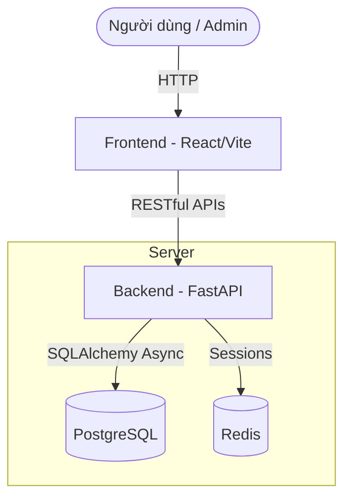

# 2.4.1 Thiết kế kiến trúc

## Trình bày các khái niệm thiết kế kiến trúc
Thiết kế kiến trúc là quá trình xác định các thành phần (components) của hệ thống, chức năng của mỗi thành phần, và cách thức chúng tương tác với nhau để đáp ứng các yêu cầu kinh doanh và kỹ thuật. Một kiến trúc tốt giúp hệ thống dễ dàng bảo trì, mở rộng và nâng cấp trong tương lai. Các mục tiêu chính của thiết kế kiến trúc bao gồm:
- **Tính module hóa (Modularity)**: Chia hệ thống thành các phần nhỏ độc lập.
- **Tính khả năng mở rộng (Scalability)**: Hệ thống có thể xử lý lượng tải lớn hơn.
- **Hiệu năng (Performance)**: Đảm bảo thời gian phản hồi nhanh và sử dụng tài nguyên hiệu quả.
- **Tính bảo mật (Security)**: Ngăn chặn các truy cập trái phép.

## Lựa chọn kiểu kiến trúc cho hệ thống của nhóm mình
Dự án **Cửa hàng tiện lợi (Quick Commerce)** sử dụng kiến trúc **Client-Server (Khách-Chủ)** theo mô hình **SPA (Single Page Application)** kết hợp với kiến trúc **RESTful API**.

- **Client (Frontend)**: Được xây dựng bằng React (với TypeScript và Vite). Đóng vai trò hiển thị giao diện người dùng, quản lý trạng thái ứng dụng (State Management) và định tuyến (Routing).
- **Server (Backend)**: Được xây dựng bằng Python với framework FastAPI.
- **Database**: Sử dụng PostgreSQL kết hợp SQLAlchemy. Redis được sử dụng cho bộ nhớ đệm (Caching).

Lý do lựa chọn:
- **Tốc độ và hiệu năng**: FastAPI là framework Python cực kỳ nhanh, kết hợp với PostgreSQL Async giúp hệ thống phản hồi tức thời. React với DOM ảo giúp UI mượt mà.
- **Tính phân tách (Decoupling)**: Frontend và Backend hoạt động độc lập qua API.

## Bản thiết kế kiến trúc cho hệ thống phần mềm của nhóm

