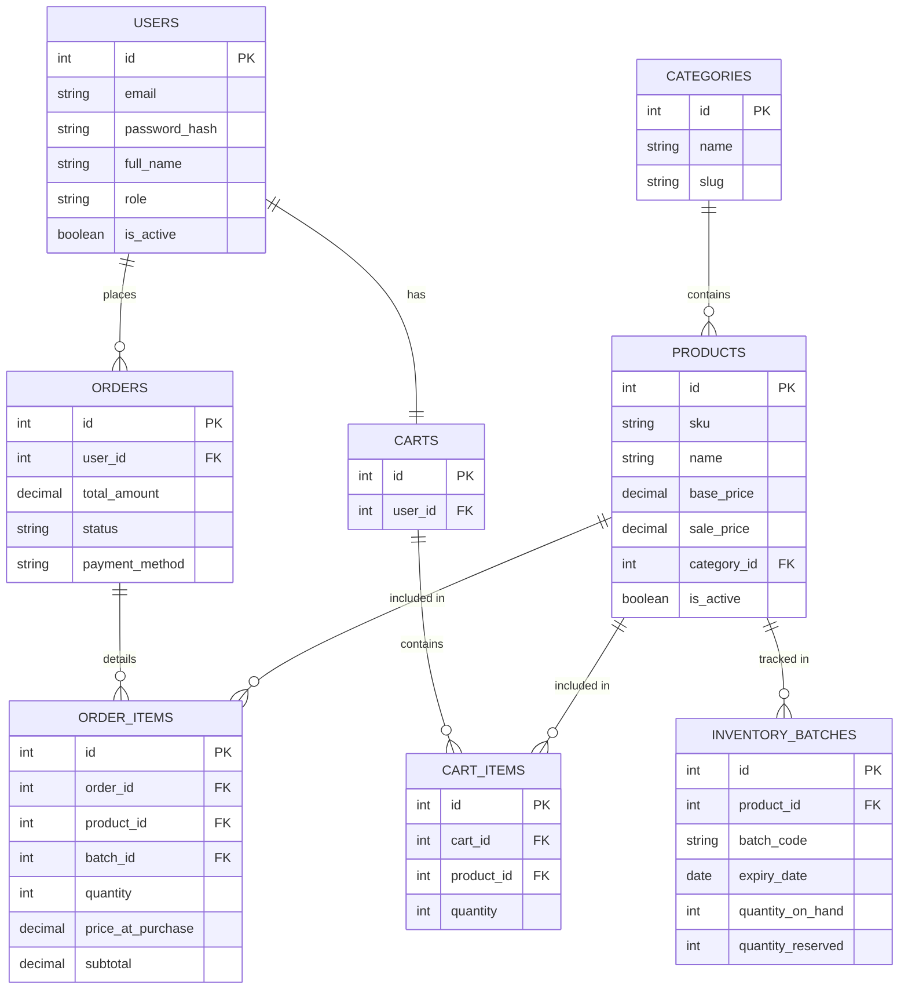

# 2.4.4 Thiết kế cơ sở dữ liệu

## Thiết kế Cơ sở dữ liệu của nhóm mình

### Phân tích yêu cầu
Hệ thống **Cửa hàng tiện lợi (Web_Shop)** cần lưu trữ thông tin về:
- **Người dùng (Users)**: Thông tin cá nhân, tài khoản, vai trò (admin, nhân viên, khách hàng).
- **Sản phẩm (Products) & Danh mục (Categories)**: Thông tin mô tả hàng hóa, giá bán, độ tuổi giới hạn (nếu có).
- **Quản lý Kho (Inventory Batches)**: Quản lý hàng tồn kho, lô nhập, hạn sử dụng để hỗ trợ xuất hàng theo hạn (FEFO).
- **Giỏ hàng (Carts) & Chi tiết Giỏ hàng (Cart Items)**: Lưu trữ tạm thời sản phẩm khách hàng muốn mua.
- **Đơn hàng (Orders) & Chi tiết Đơn hàng (Order Items)**: Ghi nhận giao dịch, tổng tiền, trạng thái vận chuyển và thanh toán.

### Thiết kế mô hình khái niệm & Mô hình vật lý
* Dữ liệu được tổ chức dưới dạng các thực thể quan hệ trên PostgreSQL.

### Chuẩn hóa dữ liệu
Cơ sở dữ liệu được thiết kế đạt chuẩn 3NF:
- Không có thuộc tính lặp.
- Tất cả thuộc tính không khóa đều phụ thuộc hoàn toàn vào khóa chính.
- Không có phụ thuộc bắc cầu (ví dụ: `order_items` lưu trữ snapshot của `price_at_purchase` thay vì tham chiếu liên tục `products.sale_price` để tránh việc đổi giá sau này làm sai lệch tổng hóa đơn cũ).

## Các liên kết và thực thể chính
- **Users (1 - N) Orders**: Một người dùng có thể tạo nhiều đơn hàng.
- **Users (1 - 1) Carts**: Mỗi người dùng (hoặc session) có một giỏ hàng hiện tại.
- **Categories (1 - N) Products**: Một danh mục chứa nhiều sản phẩm.
- **Products (1 - N) Inventory Batches**: Một sản phẩm có thể nhập về qua nhiều lô hàng khác nhau (với hạn sử dụng và số lượng tồn kho khác nhau).
- **Orders (1 - N) Order Items**: Đơn hàng bao gồm nhiều dòng sản phẩm chi tiết.
- **Products (1 - N) Order Items**: Sản phẩm xuất hiện trên nhiều thông tin chi tiết đơn hàng khác nhau.

## Mô hình thực thể liên kết ERD

## Bảng thiết kế các chức năng (Mã chức năng; tên chức năng; mô tả)

| Mã chức năng | Tên chức năng | Mô tả |
|---|---|---|
| F-AUTH-01 | Đăng nhập/Đăng ký | Xác thực người dùng và đăng ký tài khoản khách hàng mới. |
| F-PROD-01 | Xem danh sách sản phẩm | Hiển thị sản phẩm theo danh mục, lọc và tìm kiếm. |
| F-PROD-02 | Xem chi tiết sản phẩm | Hiển thị đầy đủ thông tin mô tả, giá và tồn kho của sản phẩm. |
| F-CART-01 | Quản lý giỏ hàng | Thêm, sửa số lượng, xóa sản phẩm khỏi giỏ hàng. |
| F-ORD-01 | Đặt hàng (Checkout) | Xác nhận thông tin giao hàng, phương thức thanh toán và tạo đơn. |
| F-ADM-01 | Quản lý danh mục | (Dành cho Admin/Staff) Thêm, sửa, xóa danh mục sản phẩm. |
| F-ADM-02 | Quản lý sản phẩm | (Dành cho Admin/Staff) Thêm, sửa, xóa thông tin sản phẩm. |
| F-INV-01 | Quản lý tồn kho | Khai báo lô hàng mới, cập nhật số lượng nhập kho, theo dõi hạn sử dụng (FEFO). |
| F-ADM-03 | Quản lý đơn hàng | Cập nhật trạng thái đơn hàng (đang soạn, đang giao, hoàn thành, hủy). |
